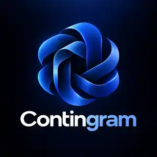
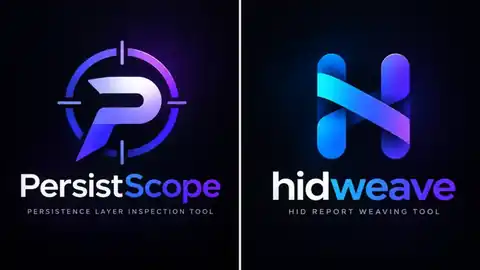
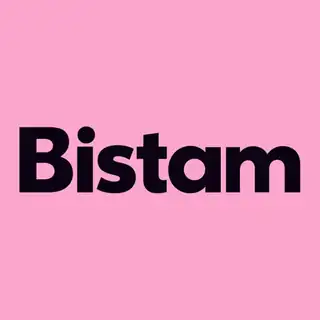
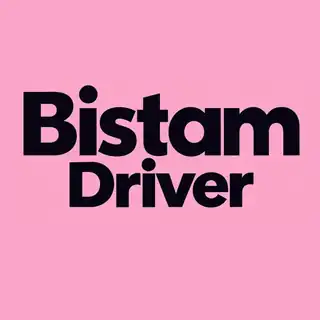
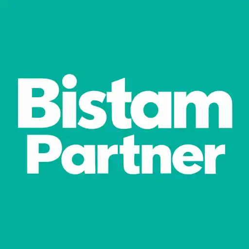
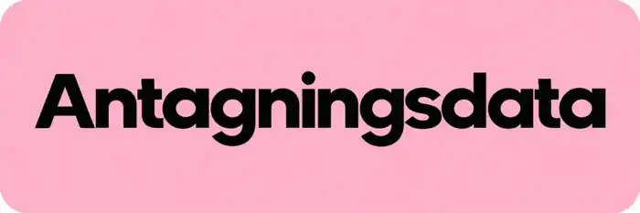

# Nima Khaki

**Software / Systems Engineer · State, ownership & recovery**

I create systems that make failure understandable: AI-agent verification tools, backend workflows, data platforms and native applications.

Stockholm, Sweden · [Portfolio](https://nima0101.github.io/) · [Engineering index](ENGINEERING_INDEX.md) · [Email](mailto:nima.khakii@outlook.com)

## What I've worked on over the last few days

<!--START_SECTION:waka-->
<!--END_SECTION:waka-->

## Contingram — AI-agent systems & verification

**Created and maintained by Nima Khaki.**

An AI agent can call a tool with real side effects, then lose the response. Blind replay may duplicate the action. **[Contingram](https://github.com/Nima0101/contingram)** models finite agent-tool contracts and uncertain observations, synthesizing a bounded safe recovery policy when it can establish one. An independent verifier checks the artifact. Bounded computation may return **UNKNOWN**.

This Rust library and CLI works offline and never executes modeled external tools. Results are relative to the supplied model and decision horizon; it is verification infrastructure, not a chatbot or general autonomous agent.

[Architecture](https://github.com/Nima0101/contingram/blob/main/docs/architecture.md) · [Verification](https://github.com/Nima0101/contingram/blob/main/docs/verification.md) · [CI](https://github.com/Nima0101/contingram/actions/workflows/ci.yml) · [Release](https://github.com/Nima0101/contingram/releases/tag/v0.1.0)

## Public systems tools

**[PersistScope](https://github.com/Nima0101/persistscope) · C++20** — Crash-consistency model checker for small persistence protocols: replayable counterexamples and witnesses, bounded exploration and explicit incomplete outcomes.

[Model](https://github.com/Nima0101/persistscope/blob/main/docs/architecture.md) · [CI](https://github.com/Nima0101/persistscope/actions/workflows/ci.yml) · [Releases](https://github.com/Nima0101/persistscope/releases)

**[hidweave](https://github.com/Nima0101/hidweave) · Rust** — HID report-contract analysis explaining how identical bytes change meaning after descriptor changes. Unsupported semantics fail explicitly.

[Contract](https://github.com/Nima0101/hidweave/blob/main/docs/contract.md) · [CI](https://github.com/Nima0101/hidweave/actions/workflows/ci.yml) · [Releases](https://github.com/Nima0101/hidweave/releases)

Created and maintained by Nima Khaki. Both publish Linux, macOS and Windows binaries; public CI includes tests, sanitizers, fuzzing checks and security analysis.

## Selected systems built by Nima Khaki

### Bistam · Rider / Driver / Partner

  

Rider · Driver · Partner (left to right).

**Created & engineered by Nima Khaki.** Rider, Driver and Partner experiences spanning backend APIs, PostgreSQL/Supabase, payment reconciliation, mobility/location, native iOS with Swift/SwiftUI and reliable device execution.

### Antagningsdata

**Created & engineered by Nima Khaki.** Data ingestion, provenance/lineage, deterministic identity and reviewed publication using Python, PostgreSQL/SQL and TypeScript/Next.js.

### Cederdalen

**Created & engineered by Nima Khaki.** B2B product workflows in Next.js/React/TypeScript and PostgreSQL/Supabase: transactional quote/order state, validation, accessibility and technical SEO.

## AI-assisted engineering, human accountability

I define the problem, system and risk boundaries, constraints, acceptance criteria and invariants. AI agents research, inspect, propose and implement in bounded workspaces, with explicit MCP/tool contracts and orchestration limits.

Root-cause claims require code, log, test, provider or runtime evidence. Generated changes face relevant tests, static analysis, fuzz/security checks and CI. Difficult architecture and OSS choices receive independent/adversarial review.

I own architecture, scope, acceptance, merge and release decisions. Runtime/release evidence governs “fixed”, “supported” and “released”; clean-room and public/private boundaries remain explicit. [Contingram’s AI-assisted engineering notes](https://github.com/Nima0101/contingram/blob/main/docs/ai-assisted-engineering.md) document this workflow in a public project.

**Core:** C++20 · Rust · TypeScript / Node.js · Python · PostgreSQL · Swift / SwiftUI. My [engineering index](ENGINEERING_INDEX.md) connects distributed systems, reliability, data engineering, developer tooling, CI/CD and observability to concrete mechanisms.

[Portfolio](https://nima0101.github.io/) · [nima.khakii@outlook.com](mailto:nima.khakii@outlook.com)
